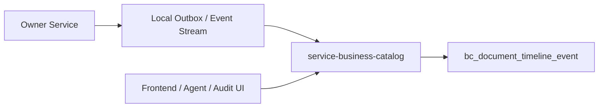

# Business Catalog Architecture

## Purpose

`service-business-catalog` is the document timeline projection service. It gives GUI, LUI, Agent, audit, and support tooling one stable timeline query contract without taking ownership of business state or process object metadata.

This service no longer owns the Business Object Catalog. Process-aware business object metadata is hosted by `service-workflow-engine` through `/api/v1/process-business-objects/**` and the `wf_biz_object*` tables.

## Responsibilities

`service-business-catalog` owns:

- `POST /internal/v1/business-timeline/events`
- `GET /api/v1/business-timeline`
- `bc_document_timeline_event`
- timeline redaction, tenant-filtered query, and database pagination

It does not own:

- business object manifests or `bc_business_object`
- workflow process object metadata
- owner action execution state
- lowcode, workflow, OpenAPI, auth, or owner-service audit tables
- historical `act_*` runtime reads

## Data Ownership

Owner services keep their own domain state and audit facts. When an owner operation should appear on a document timeline, the owner emits a bounded `BusinessTimelineEventRecord` with a stable `eventId`.

Current MVP delivery may use the internal HTTP endpoint. The long-term preferred shape is owner local outbox or Kafka projection:

`service-business-catalog` must not add cross-service joins to owner audit tables. New sources must project into `bc_document_timeline_event` first.

## Query Model

Timeline reads use SQL pagination over `bc_document_timeline_event`.

Required query boundary:

- `tenantId`
- at least one target or correlation filter, such as `targetType + targetId`, `actionId`, `traceId`, `correlationId`, or `ownerExecutionRef`

Primary index families:

- `(tenant_id, target_type, target_id, occurred_at DESC)`
- `(tenant_id, action_id, occurred_at DESC)`
- `(tenant_id, trace_id, occurred_at DESC)`
- `(tenant_id, correlation_id, occurred_at DESC)`

Offset pagination is acceptable for the current page sizes. If timelines become deep or high-volume, the next step is cursor pagination by `(occurred_at, id)`.

## Migration Notes

- `V3__drop_business_catalog.sql` removes local object catalog storage from `service-business-catalog`.
- `V4__drop_historical_timeline_tables.sql` removes local historical `act_*` projection tables from the timeline service.
- Pre-migration action history should be handled through archive, backup, or dedicated audit export instead of reintroducing runtime `act_*` reads.

## Guardrails

- Do not restore `/api/v1/business-catalog/**` under `service-business-catalog`.
- Do not read owner-service database tables from `service-business-catalog`.
- Do not implement in-memory merge pagination across sources.
- Do not store raw secrets, credentials, identity numbers, bank data, phone numbers, tokens, or raw prompt content in timeline summaries.
- Owner services must retry timeline delivery with the same stable `eventId`.
