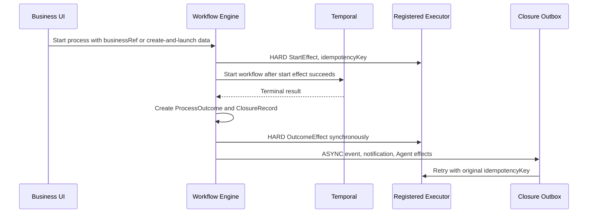

# Business Process Closure Foundation

本说明记录流程平台的业务对象闭环第一版约定：目录放在
`service-workflow-engine` 内，数据库注册可选项，代码注册执行器，设计器用
业务对象优先的选择式配置生成不可编辑的流程定义。

## Core Model

| Area | Tables | Purpose |
|---|---|---|
| Business catalog | `wf_biz_object` | 业务对象主记录，含 `tenant_id`、`type_code`、`version`、`status` |
| Status options | `wf_biz_object_status` | 单据状态选择项，例如草稿、审批中、已通过 |
| Form options | `wf_biz_object_form` | 可绑定表单，第一版供设计器选择和发布快照 |
| Permission options | `wf_biz_object_permission` | 业务动作到现有 RBAC `permission_code` 的映射 |
| Action options | `wf_biz_object_action` | 可选业务动作，只保存 `executor_key` 和参数 schema |
| Event options | `wf_biz_object_event` | 可选领域事件和 payload schema |
| Agent options | `wf_biz_object_agent_action` | 预注册 Agent follow-up 动作和参数 schema |
| Templates | `wf_biz_object_template` | 推荐发起、闭环、可视化模板 |
| Outcome contract | `wf_process_outcome` | 流程终态对业务、数据、AI 的标准结果契约 |
| Closure runtime | `wf_process_closure`, `wf_closure_effect`, `wf_closure_outbox` | 闭环记录、effect 记录和软闭环 outbox |
| Consumer events | `wf_process_business_event` | 标准化 outcome/closure 事件，避免消费 Workflow 内部表 |

目录记录生命周期为 `DRAFT / PUBLISHED / OFFLINE`。流程发布只能引用
`PUBLISHED` 有效目录，发布后会把业务对象、权限、发起计划、闭环计划和 Agent
计划快照到 `wf_process_package`，后续目录改名或下线不影响已发布版本。

## Database Registration Example

数据库只注册“能选什么”，不注册 URL、SQL、脚本、动态类或自由 Prompt。
副作用必须由代码执行器实现，并通过 `executor_key` 绑定。

```sql
INSERT INTO wf_biz_object(
  id, tenant_id, type_code, display_name, service_code, version, status
) VALUES (
  'BIZ_PURCHASE_ORDER', 'GLOBAL', 'purchase_order', '采购单',
  'purchase-service', 1, 'PUBLISHED'
);

INSERT INTO wf_biz_object_status(
  id, object_id, status_code, display_name, status_group, is_initial, is_terminal
) VALUES
  ('BIZ_PO_DRAFT', 'BIZ_PURCHASE_ORDER', 'DRAFT', '草稿', 'INITIAL', true, false),
  ('BIZ_PO_APPROVED', 'BIZ_PURCHASE_ORDER', 'APPROVED', '已通过', 'SUCCESS', false, true);

INSERT INTO wf_biz_object_permission(
  id, object_id, action_code, display_name, permission_code, action_group
) VALUES
  ('BIZ_PO_SUBMIT', 'BIZ_PURCHASE_ORDER', 'submit', '提交采购单',
   '/api/v1/process-instances/start:POST', 'LAUNCH');

INSERT INTO wf_biz_object_action(
  id, object_id, action_code, display_name, action_type, executor_key,
  mode_default, permission_action, param_schema_json
) VALUES (
  'BIZ_PO_UPDATE_STATUS', 'BIZ_PURCHASE_ORDER', 'updateStatus',
  '更新采购单状态', 'UPDATE_STATUS', 'purchase_order.updateStatus',
  'HARD', 'submit',
  '{"type":"object","required":["status"],"properties":{"status":{"type":"string","title":"目标状态"}}}'
);
```

Tenant override uses another `wf_biz_object` row with the same `type_code` and a
tenant-specific `tenant_id`; effective catalog resolution prefers tenant rows and
falls back to `GLOBAL`.

## Executor Registry Contract

Side effects must implement one of:

- `BusinessActionExecutor`: status update, create document, notification, or other business actions.
- `ClosureEffectExecutor`: platform-owned closure effects.
- `AgentFollowUpExecutor`: pre-registered Agent follow-up actions.

Executor requirements:

- `executorKey` must match the catalog row and be registered at application startup.
- All executors must be idempotent by `idempotencyKey`.
- No executor may infer arbitrary URL, SQL, class name, script, or Prompt from catalog rows.
- Failures must return explicit `resultCode` and `message`; runtime persists these into `wf_closure_effect`.
- TraceId and operator context must be forwarded through the context record.

## Designer Flow


Normal configuration never asks users to type `executorKey`, permission code,
JSON path, SQL, script, URL, or Prompt. The technical preview is read-only and
exists for diagnostics.

## Runtime Closure



Hard effects block business completion when they fail. Soft effects keep the
approval result visible and expose retry. Manual mark-as-handled is only allowed
when the effect params explicitly enable it and the caller has retry-closure
permission; the operation writes an audit payload with operator, reason, TraceId,
original error, and resulting status.

## First Sample

The seed catalog registers `expense_report` with:

- statuses: `DRAFT`, `IN_APPROVAL`, `APPROVED`, `REJECTED`
- launch modes: existing document and create-and-launch
- actions: `createDocument`, `updateStatus`, `notifyApplicant`
- events: `ExpenseReportApproved`, `ExpenseReportRejected`
- Agent actions: `riskCheck`, `paymentSummary`

This sample is the acceptance path for the first version. New objects should
follow the same catalog shape and add code executors before publication is
allowed.
