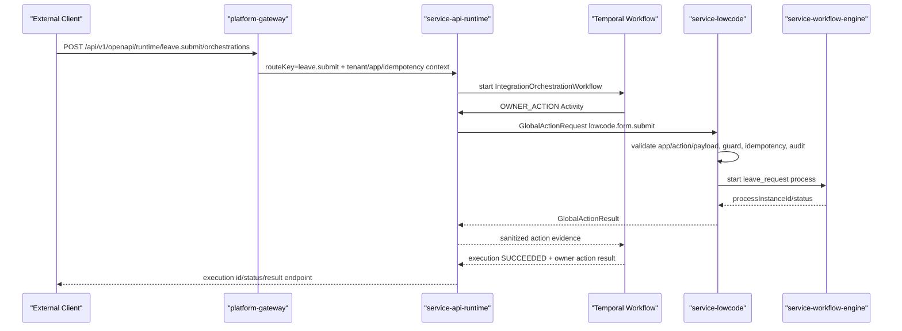

# OpenAPI Leave Owner Action Flow

This document records the canonical end-to-end OpenAPI flow for exposing the seeded lowcode leave request as one open API while keeping business execution inside the lowcode owner service.

## Runtime Chain



## Public Request Shape

The public route should accept a business-facing payload and map it into the owner action payload before the `OWNER_ACTION` step:

```json
{
  "requestId": "leave-20260727-001",
  "applicant": "admin",
  "leaveType": "ANNUAL",
  "startDate": "2026-07-27",
  "endDate": "2026-07-28",
  "reason": "family matter"
}
```

The seeded development route is:

- Route key: `leave.submit`
- Environment: `DEV`
- Application client id: `OA_CLIENT_LEAVE_DEV`
- Subscription id: `OA_SUB_LEAVE_DEV`
- Runtime endpoint: `POST /api/v1/openapi/runtime/leave.submit/orchestrations`

Required runtime headers for local gateway-style admission:

```http
X-Gateway-Authenticated: true
X-OpenAPI-Gateway-Secret: <OPENAPI_GATEWAY_AUTH_SECRET>
X-Tenant-Id: default
X-Environment: DEV
X-Application-Client-Id: OA_CLIENT_LEAVE_DEV
X-Subscription-Id: OA_SUB_LEAVE_DEV
Idempotency-Key: leave-20260727-001
```

The request mapping or a preceding `TRANSFORM` step should produce:

```json
{
  "requestId": "leave-20260727-001",
  "actionPayload": {
    "appKey": "leave",
    "actionCode": "submitAndLaunch",
    "data": {
      "applicant": "admin",
      "leaveType": "ANNUAL",
      "startDate": "2026-07-27",
      "endDate": "2026-07-28",
      "reason": "family matter"
    }
  }
}
```

## Orchestration Step

```json
{
  "schemaVersion": "1",
  "start": "submitLeave",
  "steps": [
    {
      "key": "submitLeave",
      "type": "OWNER_ACTION",
      "ownerService": "service-lowcode",
      "actionType": "lowcode.form.submit",
      "targetType": "LOWCODE_FORM",
      "targetId": "leave",
      "payloadPointer": "/actionPayload",
      "idempotencyKeyPointer": "/requestId",
      "executionMode": "SYNC",
      "outputPointer": "/ownerAction",
      "next": "end"
    },
    {
      "key": "end",
      "type": "END"
    }
  ]
}
```

## Closure Criteria

- OpenAPI execution state is `SUCCEEDED`.
- `oa_execution_step_attempt.step_type` contains `OWNER_ACTION`.
- The step attempt records `action_id`, `action_type=lowcode.form.submit`, `action_source=API`, `action_actor_id=<applicationClientId>`, `action_trace_id`, and `action_correlation_id=<executionId>`.
- Lowcode action audit records the same action id and emits a business timeline event.
- Lowcode creates a leave form instance and binds the workflow process instance returned by `service-workflow-engine`.

## Architecture Rule

Do not model platform owner services as arbitrary OpenAPI connectors. Internal business mutations must go through owner-hosted Global Actions so that authorization, guards, idempotency, audit, and business state ownership remain with the owning service.
